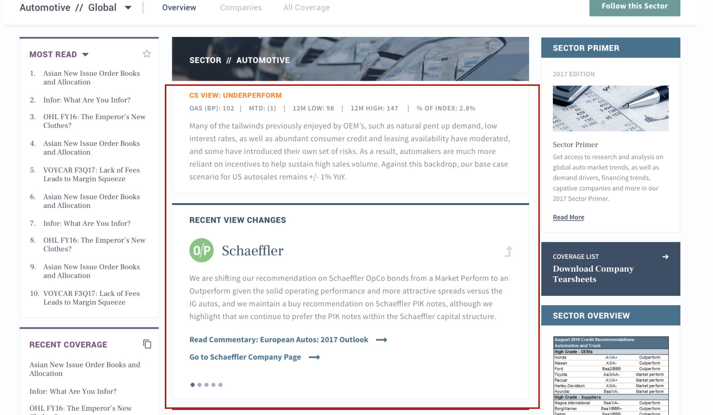

## Discussion {#intro}

### Federated APIs? {#federated}

As mentioned in the introduction there are a few places in the mockup where, strictly speaking, content from a range of different sources is combined together. 

For example if you consider the case of "recent view changes" within a sector. 
[](https://projects.invisionapp.com/share/3AB3R5F4S#/screens/226615007). The steps to doing this are:
 - Find the most recent recommendation change in the sector (Recs API)
 - Find the details (such as Display Name) about that company (Taxonomy API)
 - Find the article coresponding to that recommendation change and load its title / summary (Content API)

This isn't necessarily a huge problem but it is worth thinking about where this sort of combination should occur. Walking this through here are a few ways we could handle this. 

- One approach would be to put all the info we need in the 'content' model of the article, so that it's just a content query. (Which involves the Content API talking to Recommendations and Taxonomy API.)
- Another approach would be to put all the info we need in the Recommendations API (which involves the Recommendations API talking to the other APIs)
- But what happens if we add a requirement to customize for the preferences of the current user. Do we now need to have all API's talking to the profile API? Should we perhaps instead introduce a 'federation API' whose job is to call the other APIs and then combine this information before returning to the client. 
- Alternatively, should we stick strictly with the original vision and keep all this logic entirely on the client side, even if it might involve quite a chatty back and forth interaction on multiple sockets.

It feels like there are three broad approaches to this problem:

1. "Truly distributed" / "All Client Side" (per last suggestion above) 

1. "Federated GraphQL Server" / "Fan in - fan out" (per second to last idea above)

1. "Client Side Widget - Service API pairings" (first two above)


Which is better? To be discussed.

### Example of a combined query via GraphQL {#combined_query}

For the record, using GraphQL it is possible (but not necessary) to combine a range of queries into a single document request, which can allow more efficiency in network access and such, if that is an important consideration. Whether it is worthwhile remains to be decided, but it is worth noting. Obviously this is only possible in a 'federated API' situation like option 2 above. 

```
query {

topReadLeft: allContents (
  first: 5,
  orderBy: viewsLast24Hrs_DESC,
  types: ["analysis", "reports"],
  filter: {
    AND: [
      { tags_some: { tagId: "tag/high_yield" } },
      { tags_some: { tagId: "region/europe" } },
      { tags_some: { tagId: "feedtag/european_subscriber_highlight" } }
    ]
  })
  {
  title,
  contentType,
  publishDate
},

mainBody:allContents (
  filter: {
    AND: [
      { tags_some: { tagId: "tag/high_yield" } },
      { tags_some: { tagId: "region/europe" } },
      { tags_none: { tagId: "tag/emerging_markets" } }
    ]
  },
  first: 5,
  orderBy: publishDate_DESC)
  {
  title,
  contentId,
  contentType
  }
},

 freeTrial:content(path:"/element/free_trial") {
    title,
    intro,
    buttonText
  }
}


}

```

``` json
{
  "data": {
    "topReadLeft": [
      {
        "title": "CNHI 3Q16: Margins Improve, Down-cycle Continues",
        "contentId": 199948,
        "contentType": "EarningsNote"
      },
      {
        "title": "Sterling Spreads: Week Ended, October 28, 2016",
        "contentId": 199881,
        "contentType": "SterlingSpreads"
      },
      {
        "title": "Euro Spreads: Week Ended, October 28, 2016",
        "contentId": 199877,
        "contentType": "EuroSpreads"
      },
      {
        "title": "Global Ship Lease 3Q16: Tick Tick Tick ...",
        "contentId": 199853,
        "contentType": "EarningsNote"
      },
      {
        "title": "Euro Financial Movers: The Trading Games",
        "contentId": 199765,
        "contentType": "euroFinancialMovers"
      }
    ],
    "mainBody": [
      {
        "title": "HY Note: EA Partners I & II",
        "contentId": 199150,
        "contentType": "HighYieldNotes"
      },
      {
        "title": "Groupama 1H16 Tearsheet",
        "contentId": 199810,
        "contentType": "FundamentalsTearsheet"
      },
      {
        "title": "4Q16 European Quarterly Credit Market Monitor",
        "contentId": 199982,
        "contentType": "EuroQuarterlyCreditMonitor"
      },
      {
        "title": "4Q16 European Quarterly Credit Market Monitor",
        "contentId": 199982,
        "contentType": "EuroQuarterlyCreditMonitor"
      },
      {
        "title": "Iceland Foods F2Q17: Return to Growth - Buy",
        "contentId": 199989,
        "contentType": "EarningsNote"
      }
    ],
    "freeTrial":  {
      "title": "Request a Free Trial",
      "intro": "Creditsights offers free trials to individuals in qualified institutions. At this time, we do not offer individual reports, products or services for the retail investor.",
      "buttonText": "Request a Trial"
    }
  }
}

```